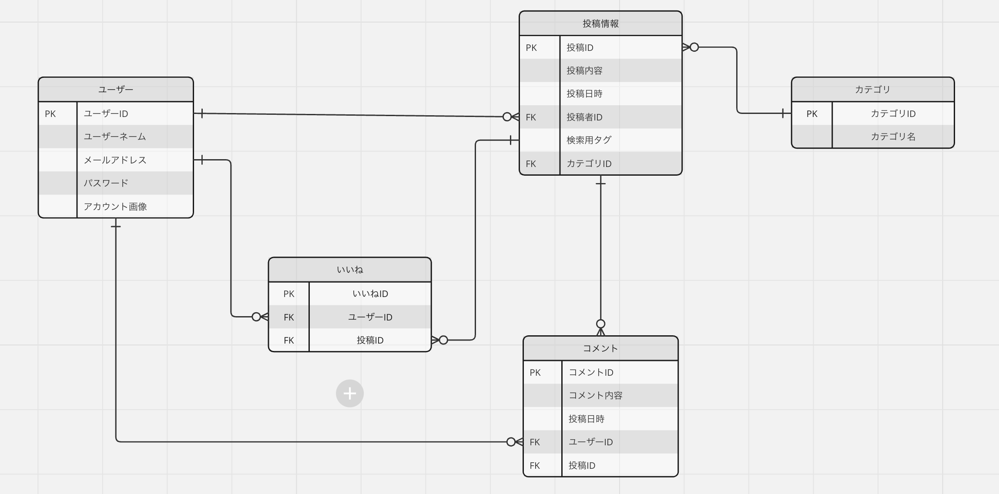
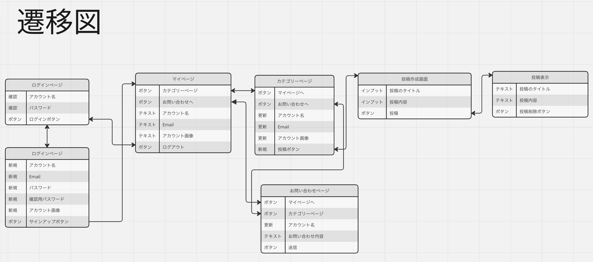

# サービス概要
### アプリ名
#### ShooolDays
### 概要
簡単に使える学生向けの掲示板アプリ
## サービスの作成理由
学生が気軽に色々な人と交流できたり、意見をしあえる場があったらいいなという理由で作成しました
## 使い方
clone後対象のファイルへ入り```docker-compose up```<br>
その後ブラウザを立ち上げ```http://127.0.0.1:8888```へ接続
## メイン機能
- サインアップ・ログイン機能
- 投稿機能
    - 掲示板のカテゴリー分け
    - 掲示板の検索の検索
- 自分のアカウントの表示（マイページ）
- 今まで見てきた掲示板の表示（閲覧履歴）
## 使用技術
| カテゴリー    | 技術 |
| :---------- | :----------|
| フロントエンド | HTML/CSS/JS |
| バックエンド   | Flask/Python |
| データベース   | MySQL |
| 仮想環境      | Docker |
## ER図
<br>
## ページ遷移

